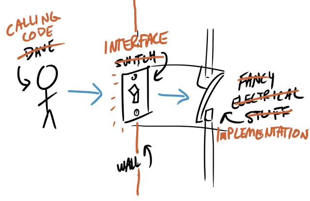
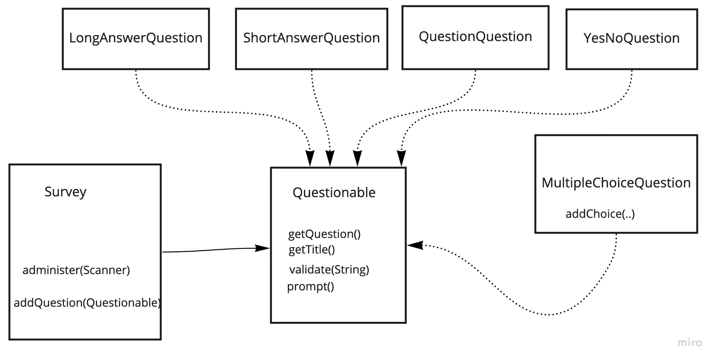
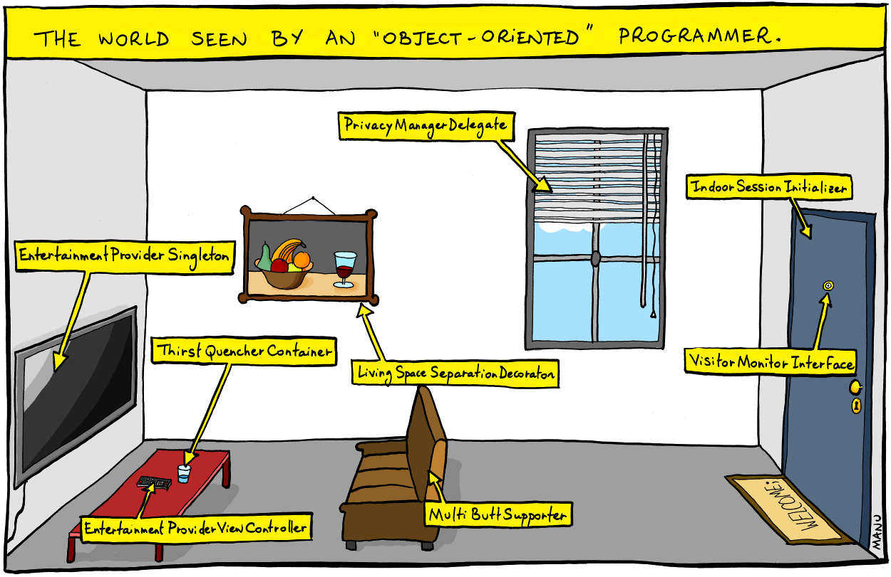

# Exercise 0.1 - 📝 Survey

## 🎯 Objectives

- **Define** what an interface is in object-oriented programming.
- **Implement** an interface for a survey application.
- **Read** input from the user.
- **Write** output to the console and a file.

## 🔨 Setup

1. Clone the repo (or download the zip) for this exercise, which you can find [here](https://github.com/JAC-CS-Programming-4-W23/E0.1-Survey).
2. Start IntelliJ, go to `File -> Open...`, and select the cloned/downloaded folder.
3. If at the top it says "Project JDK is not defined", click "Setup JDK" on the top right, and select the JDK version you have installed on your machine.

   

## 🔍 Context

An **interface** in object-oriented programming is a set of variables and functions that a class must implement.

- 🦴 "Skeleton" aspect: the implementing class "fills out" the structure of the interface.
- 📑 "Contract" aspect: the implementing class must implement each of the method signatures defined in the interface declaration.
- 🔌 "Membership" aspect: the implementing class can be supplied wherever the interface type is used, i.e.: where code is written in terms of the interface.

Here's an excellent example of interfaces by [Dave Leeds](https://www.hitthebits.com/p/about-me.html):

[](https://www.hitthebits.com/2012/11/what-are-interfaces.html)

The light switch provides an easy way for the caller to turn the lights on without the caller having to know anything about the fancy electrical stuff! This concept goes hand in hand with the OOP concept of [abstraction](https://www.digitalocean.com/community/tutorials/what-is-abstraction-in-oops).

---

The interface `Questionable` is used to structure the survey app:



## 🚦 Let's Go

1. Run the application by clicking the green play button in IntelliJ and answer the survey questions.
   - Make sure to honestly answer the questions because I _will_ be reading your response!
   - Once you're finished, please make sure to submit `output.txt` to Moodle.
2. Before we actually code anything, make sure to go through all of the classes inside of the `survey` directory and make sure you understand all of them. If you run into something you're not sure about, and a quick Google doesn't answer your question, please ask me!
3. Once you're good with the existing code, go to `Questionable.java` and uncomment the `prompt()` method at the end of the class.
   - Recall that any class that implements an interface **must** implement all the methods listed in the interface. After uncommenting the new method, are you still able to run the program?
4. Fix the errors by implementing the new `prompt()` method in each class that `implements Questionable`.
   - Call the new `prompt()` method if the user enters an invalid response to a question.
   - There should be a different prompt message per question type.
5. Once the errors are fixed, create and implement `YesNoQuestion.java`.
6. After that, create and implement `MultipleChoiceQuestion.java`.
   1. The class must have a `addChoice(..)` method.
   2. Optional: Add a `scramble()` that randomizes the order of the answers.
   3. Optional: If you allow the user to enter numbers as their answer, here is how to parse the integers:

      ```java
      int x = Integer.parseInt("123");
      ```

After all that is done, good job 🎉 - hopefully you feel like you got some solid Java practice!

## 📥 Submission

Please make sure to submit `output.txt` to Moodle!

---

[](https://bonkersworld.net/object-world)
